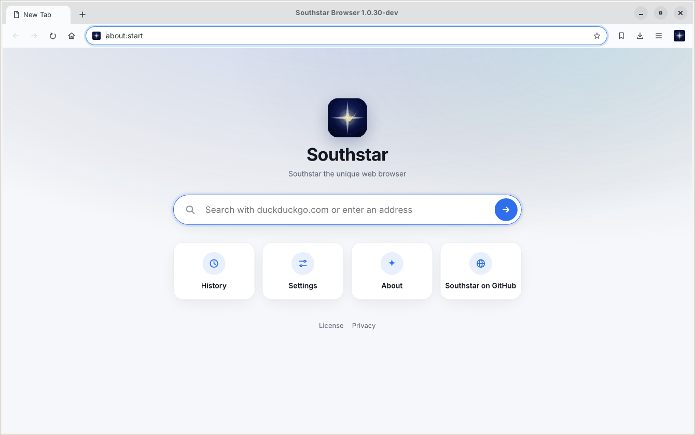

Southstar Browser
=================

Southstar Browser is a web browser focused on support for modern HTML, CSS
and JavaScript standards. It is the next step for
[Nordstjernen](https://github.com/nordstjernen-web/nordstjernen-browser)
(Northstar): Southstar will become a **Rust rewrite** of that browser.

The rewrite starts from a working browser rather than an empty repository.
This tree is the Nordstjernen C codebase — its full history included —
renamed to Southstar Browser and trimmed to the desktop: the Android, iOS and
Java/JVM versions have been removed.



Supported platforms:
* Linux
* Windows
* macOS
* FreeBSD and NetBSD

**Version:** 1.0.30-dev. Southstar has not made a release of its own yet;
[Changelog.md](Changelog.md) records the Nordstjernen releases it grew from.

**Standards.** Behaviour is measured against the spec text, section by
section, not against another browser. The walk-through of the in-scope
WHATWG HTML standard (§1–§16) in
[docs/HTML-compatibility.md](docs/HTML-compatibility.md) records **140 spec
rows fully implemented, 31 partial, 0 absent** (July 2026), besides a handful
that are non-goals by design: `embed`/`object` plugins, `frame`/`frameset`,
`applet`/`marquee`, telemetry, and AI-style web APIs.

**Security.** Each tab's engine runs in its own sandboxed process (seccomp +
Landlock on Linux) behind an IPC + shared-memory-framebuffer boundary. No JIT.

**Minimalism.** The core engine is about 210,000 lines of project C and
headers, excluding vendored libraries and generated assets — small enough for
one person to read and audit end-to-end.


## Roadmap

- [x] Start from Nordstjernen: import the C codebase with its history, rename
      it to Southstar Browser, and remove the Android, iOS and Java versions.
- [ ] Rewrite the browser in Rust — the plan is in
      [docs/rust-port.md](docs/rust-port.md).

What the rewrite starts from — the processes, the engine's data model and how
they fit together — and the order it is ported in are described in
[docs/rust-port.md](docs/rust-port.md).

## Download

There are no Southstar binaries yet — build from source (below). The
per-platform build and packaging notes are in [docs/](docs/README.md).

## Browser features

- **HTML/CSS** — HTML is parsed by the in-tree lexbor engine; the CSS engine
  covers the modern cascade and CSSOM, Media Queries Level 4, container
  queries and units, flex, grid, transforms, gradients, animations and
  vertical writing modes.
- **Text layout** — text is shaped with **ns-pango**, a Pango fork
  pinned as a meson subproject that caches finished glyph strings and font
  metrics across layouts, so measuring and painting a run reach HarfBuzz once
  instead of three times. `-Dns-pango=disabled` links the system Pango
  instead.
- **JavaScript** on the QuickJS interpreter — DOM, Shadow DOM, observer APIs,
  Canvas 2D (`Path2D`, `ImageBitmap`, `DOMMatrix`), WebCrypto
  (`crypto.subtle` over OpenSSL), custom elements including customized
  built-ins (`is=` / `{extends}`), and the `Navigation` API for single-page
  routing, plus Web Workers, IndexedDB (over SQLite), WebSocket and
  `EventSource`. The QuickJS engine is selectable at build time: the in-tree
  quickjs-ng fork by default, or Fabrice Bellard's original QuickJS with
  `-Dquickjs=quickjs`.
- **Networking** over HTTP/2 with libcurl — HSTS, CSP, subresource-integrity
  checks, partitioned cookies, speculative subresource loading, request
  coalescing and a `Vary`-aware HTTP cache. An in-tree **libnghttp2** transport backend is selectable at build
  time (`-Dhttp_backend=nghttp2`), with **HTTP/3 over QUIC** via ngtcp2 +
  nghttp3 + gnutls when present. Both backends fetch byte-identically, so the
  independent transports cross-check each other.
- **Images and graphics** — Wuffs decodes PNG/APNG, GIF, BMP, JPEG and lossy
  WebP; libwebp handles lossless and animated WebP; ICO and SVG are rendered
  in-engine, with optional AVIF and inline PDF support.
- **Media** — `<video>` plays **inline** for MPEG-1 (decoded in-tree by
  [pl_mpeg](https://github.com/phoboslab/pl_mpeg)) and, when FFmpeg's libav is
  present at build time, **WebM** (VP9/VP8 + Opus/Vorbis). MSE/`blob:`
  streaming and HLS/DASH manifests play through the `southstar-video`
  helper, and a `<track default>` WebVTT file is drawn over the video. Other
  codecs render a poster and play overlay. See [docs/media.md](docs/media.md).
- **WebGL / WebGPU / WebAssembly** — WebGL 1/2 mapped onto OpenGL ES, on by
  default; experimental `navigator.gpu` over
  external wgpu-native, built only when that library is installed and gated
  behind `--enable-webgpu`; the full
  WebAssembly JS API over a vendored WAMR interpreter.
- **MathML** — a minimalist presentation-MathML renderer (`src/mathml.c`)
  laid out over Pango/Cairo and embedded inline on the text baseline.
- **Spell checking** — optional, via Enchant: misspelled words in editable
  text get a red wavy underline, honouring the `spellcheck` attribute.
- **Safe browsing** — a top-level navigation's host is checked against a local
  SHA-256 blocklist before it is fetched, entirely on-device; a match shows a
  full-page warning. Overridable via
  `~/.config/southstar/safebrowsing.list`.
- **Process-per-tab** — each tab's engine runs in its own sandboxed
  `southstar-renderer` process; the GTK app is a thin shell that blits the
  renderer's shared-memory framebuffer and forwards input over an IPC control
  channel, so a page can't take down the UI. `--single-process` runs
  every tab's engine in the shell process instead.
- **Privacy** — no telemetry or update pings, standards-compliant client
  hints, local-only safe browsing, partitioned cookies and a `--private`
  session mode.
- **UI** — tabs, bookmarks, history, downloads, find-in-page, printing and
  save-to-PDF, a JavaScript console, settings, headless mode, and a C
  embedding API (`src/libsouthstar.h`). The interface
  follows the operating-system language, with UI translations for 13
  languages so far (`data/i18n/`).
- **Extensions** — initial support for simple, page-facing WebExtensions
  ([docs/extensions.md](docs/extensions.md)).

## Build

```sh
sudo apt install build-essential git pkg-config meson ninja-build cargo rustc \
    libgtk-4-dev libepoxy-dev libcurl4-openssl-dev libssl-dev libuchardet-dev \
    libpsl-dev libsqlite3-dev libseccomp-dev libwebp-dev libsdl2-dev \
    libavformat-dev libavcodec-dev libavutil-dev libswscale-dev libswresample-dev
meson setup builddir && meson compile -C builddir
./builddir/src/gtk/southstar
```

Rust 1.85 or newer is required. Debian 13 ships it; on Ubuntu 24.04 install
`rustc-1.85 cargo-1.85` and put `/usr/lib/rust-1.85/bin` first on `PATH`, or
use [rustup](https://rustup.rs). Windows, Fedora, openSUSE and macOS
instructions are in
[docs/](docs/README.md); keyboard, mouse and touch controls are in
[docs/Controls.md](docs/Controls.md).

## Dependencies

Southstar is an independent engine — no upstream browser code.

**Vendored in-tree**, built from the main tree with no submodules:
[lexbor](https://github.com/lexbor/lexbor) (HTML5 → DOM parser, CSS, and the
WHATWG URL module), [QuickJS](https://github.com/quickjs-ng/quickjs)
(quickjs-ng fork, no JIT), [WAMR](https://github.com/bytecodealliance/wasm-micro-runtime)
(WebAssembly interpreter), [Wuffs](https://github.com/google/wuffs)
(memory-safe image decoding), [pl_mpeg](https://github.com/phoboslab/pl_mpeg)
(MPEG-1 video + MP2 audio) and [minimp3](https://github.com/lieff/minimp3)
(MP3). The only setup-time download is
[ns-pango](https://github.com/nordstjernen-web/ns-pango), the text-shaping
fork; `-Dns-pango=disabled` links the system Pango and needs no network.

**Required system libraries:**

| Library | Min version | Role |
|---------|-------------|------|
| GTK 4 | **≥ 4.22.1 on Windows** (MSYS2 stock), ≥ 4.14 elsewhere (≥ 4.22 preferred) | UI toolkit, GSK renderer |
| GLib / GModule, Pango | (ship with GTK) | core types, dynamic module loading, text shaping |
| libepoxy | — | OpenGL/ES function dispatch for WebGL |
| libcurl | ≥ 8.5 (≥ 8.11 for WebSocket) | HTTP/2 networking, HSTS, cookies, native WebSocket |
| OpenSSL (libcrypto) | — | WebCrypto (`crypto.subtle`) |
| uchardet | — | charset detection |
| libpsl | — | public-suffix list for cookie scoping |
| SQLite | — | IndexedDB persistent storage |
| libwebp | — | animated, lossless and fallback WebP decoding |
| SDL2 | — | audio output for the `southstar-audio` helper |
| libseccomp | — (Linux only) | syscall sandbox; no-op on macOS/Windows |

**Optional**, auto-detected or build-time-selected:
[FFmpeg](https://github.com/FFmpeg/FFmpeg) libav\* (inline WebM playback —
required on Linux and Windows, auto-detected on macOS), poppler-glib (inline
PDF), libavif (AVIF images), Enchant (spell checking), fontconfig / pangoft2
(extra font backends), [libnghttp2](https://github.com/nghttp2/nghttp2) (the
in-tree HTTP/2 backend), [ngtcp2](https://github.com/ngtcp2/ngtcp2) +
[nghttp3](https://github.com/ngtcp2/nghttp3) + GnuTLS (HTTP/3 over QUIC inside
it), [wgpu-native](https://github.com/gfx-rs/wgpu-native) (experimental
WebGPU) and Fabrice Bellard's original
[QuickJS](https://github.com/bellard/quickjs) (`-Dquickjs=quickjs`, fetched
through a meson wrap).

## License

Southstar Browser is derived from Nordstjernen and is distributed under the
same dual license: use it under **either** the Nordstjernen Source License
v1.0 **or** the GNU General Public License version 3 or later, at your option
(`LicenseRef-NSL-1.0 OR GPL-3.0-or-later`).

- **GPL-3.0-or-later** — free software: use, modify and redistribute it for any
  purpose, provided derivative works are also released under the GPL. See
  [COPYING](COPYING).
- **NSL-1.0** — use, modify and redistribute freely, except as a competing
  browser; each release becomes MIT after ten years. It is inspired by the
  [Functional Source License](https://fsl.software/).

See [License.md](License.md) for the full terms. Commercial licenses by
agreement. Bundled third-party components keep their own licenses
([THIRD-PARTY-LICENSES.md](THIRD-PARTY-LICENSES.md)).

## Related projects

- [nordstjernen-browser](https://github.com/nordstjernen-web/nordstjernen-browser)
  — the C browser Southstar starts from.
- [northstar-browser-gpl](https://github.com/nordstjernen-web/northstar-browser-gpl)
  — the GPL-licensed sibling project.

# Development team
Southstar is developed by a team located in Norway, Poland and Spain.

[Join the Discord](https://discord.gg/4W959nW5vF)

## Builds
[](https://github.com/nordstjernen-web/southstar-browser/actions/workflows/linux.yml)
[](https://github.com/nordstjernen-web/southstar-browser/actions/workflows/macos.yml)
[](https://github.com/nordstjernen-web/southstar-browser/actions/workflows/windows.yml)


----

Copyright 2026 Andreas Røsdal
